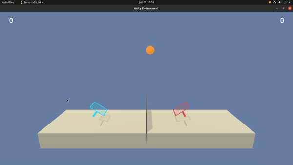
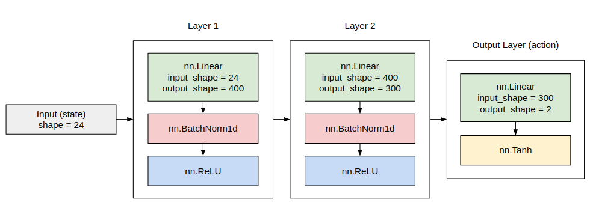
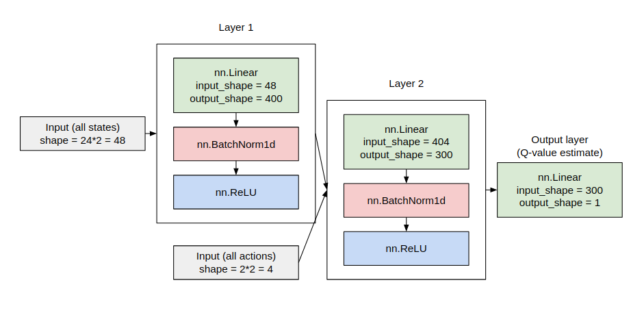

# Project 3: Collaboration and Competition

### Introduction

The goal of this project is to train two agents at once to play tennis, using a Multi Agent Deep Deterministic Policy Gradient (MADDPG). The two agents should collaborate to keep the ball bouncing for as long as they can.

This project uses the [Tennis](https://github.com/Unity-Technologies/ml-agents/blob/master/docs/Learning-Environment-Examples.md#tennis) environment.

The gif below was recorded after the agents were trained.



In this environment, two agents control rackets to bounce a ball over a net. If an agent hits the ball over the net, it receives a reward of +0.1.  If an agent lets a ball hit the ground or hits the ball out of bounds, it receives a reward of -0.01.  Thus, the goal of each agent is to keep the ball in play.

The observation space consists of 8 variables corresponding to the position and velocity of the ball and racket. Each agent receives its own, local observation.  Two continuous actions are available, corresponding to movement toward (or away from) the net, and jumping.

The task is episodic, and in order to solve the environment, the agents must get an average score of +0.5 (over 100 consecutive episodes, after taking the maximum over both agents). Specifically,

- After each episode, we add up the rewards that each agent received (without discounting), to get a score for each agent. This yields 2 (potentially different) scores. We then take the maximum of these 2 scores.
- This yields a single **score** for each episode.

The environment is considered solved, when the average (over 100 episodes) of those **scores** is at least +0.5.

### Getting Started

This project's environment is based on [Unity ML-Agents environments](https://github.com/Unity-Technologies/ml-agents). Do the following steps to setup the environment:

1. Download the environment from one of the links below.  You need only select the environment that matches your operating system:
    - Linux: [click here](https://s3-us-west-1.amazonaws.com/udacity-drlnd/P3/Tennis/Tennis_Linux.zip)
    - Mac OSX: [click here](https://s3-us-west-1.amazonaws.com/udacity-drlnd/P3/Tennis/Tennis.app.zip)
    - Windows (32-bit): [click here](https://s3-us-west-1.amazonaws.com/udacity-drlnd/P3/Tennis/Tennis_Windows_x86.zip)
    - Windows (64-bit): [click here](https://s3-us-west-1.amazonaws.com/udacity-drlnd/P3/Tennis/Tennis_Windows_x86_64.zip)

    (_For Windows users_) Check out [this link](https://support.microsoft.com/en-us/help/827218/how-to-determine-whether-a-computer-is-running-a-32-bit-version-or-64) if you need help with determining if your computer is running a 32-bit version or 64-bit version of the Windows operating system.

    (_For AWS_) If you'd like to train the agent on AWS (and have not [enabled a virtual screen](https://github.com/Unity-Technologies/ml-agents/blob/master/docs/Training-on-Amazon-Web-Service.md)), then please use [this link](https://s3-us-west-1.amazonaws.com/udacity-drlnd/P3/Tennis/Tennis_Linux_NoVis.zip) to obtain the "headless" version of the environment.  You will **not** be able to watch the agent without enabling a virtual screen, but you will be able to train the agent.  (_To watch the agent, you should follow the instructions to [enable a virtual screen](https://github.com/Unity-Technologies/ml-agents/blob/master/docs/Training-on-Amazon-Web-Service.md), and then download the environment for the **Linux** operating system above._)

2. Place the file in the project folder and unzip it.

3. To install required dependencies, follow [these steps](https://github.com/udacity/deep-reinforcement-learning#dependencies).

    I had to also update PyTorch version, as I had some issues locally when calling `.to(device)` on PyTorch tensors. Also, as I am training in a computer with an NVIDIA GPU (RTX 2070), I installed CUDA Toolkit. I also installed [PyTorch Summary](https://github.com/sksq96/pytorch-summary) to visualize the model:
    ```
    > conda install pytorch cudatoolkit=10.2 -c pytorch
    > pip install torchsummary
    ```

### Instructions

All the training procedures are inside `Tennis.ipynb`. Run all the cells to train the agent, or just run the imports cell and the Section 5, which loads trained weights into a new agent.

There are also some additional files:
- `model.py`: defines the neural network architectures using PyTorch;
- `ddpg_agent.py`: implements DDPG using the model above.
- `maddpg_agent.py`: implements MADDPG using multiple DDPG agents.
- `replay_buffer.py`: implements a replay buffer for sampling past experiences tuples.
- `normal_noise.py`: implements noise procedure to add exploration behavior to the agents.

The models' weights are saved in files `model_actor_{agent_id}.pt` and `model_critic_{agent_id}.pt`.

### DDPG Architecture

Both agents share the same architecture (but are trained separately, as stated in the MADDPG algorithm).

Each DDPG agent has two different neural network architectures, one for the actor and the other for the critic.

The architecture for the actor is shown below:



The architecture for the critic is shown below:


